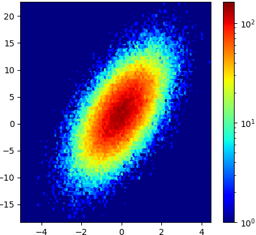

# CMPSCI-301-Data-Analytics-Allegheny-College-Spring-2023
Final Project from Allegheny College's CMPSCI-301 Data Analytics class from Spring 2023

[](https://classroom.github.com/a/G2Jq_bL6)
[](https://classroom.github.com/online_ide?assignment_repo_id=10887256&assignment_repo_type=AssignmentRepo)
# Data Analytics (CS301) 

## Course Final Project

Please be sure to read this document carefully for this project. 

## Due dates
Note: Strict deadline, no extensions are possible.

**Assigned** : Monday 17th April 2023

**Proposal Due** 20th April 2023, 3pm

**Document Due** : Thursday, 4th May 2023, 7:00pm 

**Presentations**: 1st May 2023 during lab, and Tuesday 2nd May during class as necessary.

<center>
&#x200B;

</center>

Figure 1: The data, when in textual form, is an unreadable script that generally tells us nothing of its story. However, by employing the actors ‘color’ and ‘texture’ to play out their script, the characters, ‘patterns’ and ‘trends’ become more developed to take the center-stage and steal the show.

## Objectives

* To conduct advanced research in which an original question is addressed through the use of  analysis.
* To obtain relevant data for this research. 
* To explore statistical tools which are relevant for the evaluation of data. 
* To formulate educated conclusions from own analysis.

Note: At this point in the class, there has already been much exposure to using many different types of statistical tools to handle different formats of data. 

As with the last lab, it is therefore expected that the student will be able to research code development and will be able to resolve data formatting issues while working on the analysis of data. In particular, these skills comprise the ability to research R-statistics software packages for the application to the particular contexts for which they were designed and to extract knowledge from the produced visualizations and extracted interpretation of results. Furthermore, the student will be able to explain credible results and conclusions which are to be entirely supported by the methods and data.

## Group Work

If you would like to work in groups then please do! Please keep your team to __two__ (__2__) members. 

## Summary

The final project invites you to employ the methods explored in this course to conduct a comprehensive analysis of a real-world data set. You will select an application area and exploratory questions that are of interest to you, find an appropriate data set, conduct an in-depth analysis of this data set, produce plots, and examine your findings in the context of an application area. As you work, keep your exploratory questions in light of the issues of ethics, privacy, and power dynamics.

During the analysis process you will carry out the steps of data collection, cleaning and transformation (as necessary), wrangling, correlation, modeling as necessary and visualization to be able to tell a story from your data concerning some type of trend, as noted in Figure 1.

Since much of data analysis is to provide some type of visually communicable information to be used to change policy, or create awareness for some reason, your report is to argue for or against the continuance of a particular policy, either instated or potential. In other words, your report is to introduce its pieces of analysis as a way to influence a policy (of some type). You are at liberty to select a real-world policy to contest, or to provide the discussion of a potential policy that you believe to be a benefit after an analysis of its data.

## Assignment Specifications

This project is broad and you may use whatever tools and skills from the course or from your own research into methods. For the project assignment you are to select one application area that is of interest to you from which you can obtain data (e.g., health, politics, economics, etc.).

You are to choose a broad exploratory question(s) to consider in this area. Note: Please choose three or four profound inquiries which are answered by data analysis.

Then, while keeping in mind your selected area and questions you would like to explore, find a specific real-world data set that you can analyze. Finally, you are to conduct a comprehensive analysis of your selected data set, answering questions you have designed, creating new questions to ask, and comment on any issues with the data or its analysis.

You may use anything and everything we have learned (or will learn) in class and also you should research additional resources beyond what we discussed in class. You may also extend any of the programs or concepts we have developed in the labs or in class. 

You are strongly encouraged to find new (publicly) available datasets for your study using online searches. Please see _Data_ below for more information about the dataset. 

---

## Requirements

1. Do your reading: You are expected to consult our course textbooks Silge et al. [1] and
Wickham et al. [2] to complete this work.

2. Literature requirement: Research relevant background and find at least two (2) academic
references related to the selected area and your exploratory questions.

   Please do not use blogs or websites as your references. Much of this text is likely to be unsubstantiated since it has not been subjected to an academic peer-review panel. Instead you are to use Google Scholar to locate peer-reviewed and scholarly articles which have been published by a reputable organization, and contain factual information.

3. Scope of your study: Determine what you would like to research. Isolate your research question into some manageable articulation that you will be able to address using an analysis of data. Try to be realistic in how you choose your research question: do not choose a topic which has too many smaller pieces that must be researched before your actual question may be addressed by analysis for discovery and conclusion.

4. Data: Select a large-size, real-world data set to investigate your phenomena. Your data must be free, public and available online. Your data should also be credible and originate from sources of good standing. Please perform necessary searches to locate public and credible data sets that are able to be referenced in articles. To give you ideas, there is a list of sites (below) that specialize in providing publicly available data.

    Please use a new dataset which you have not used for any other project. To help get you started in this task, there are some urls available to you to investigate at the course [resources](https://www.oliverbonhamcarter.com/resources/dataanalytics_resources/) page.

5. Wrangling: It may be necessary to clean and transform the data using functions such as filter(), mutate(), and similar from class. In addition, you will be asked to show the code and to justify all steps taken to treat (i.e., organize) your data.

6. Analysis: In your report, identify the method of your analysis: what will you measure and which techniques were required? How did you treat and detect this measurement?

7. Design and development: Develop computational techniques (i.e., R code and programs) using R’s software libraries to conduct your analysis. Your analysis should include some of the basic statistics on the data to provide a global view, as well as, steps to explore the relationships between variables. If you are building a model to make predictions, please try to confirm/deny a hypothesis.

8. Plots: Making plots, summaries and interpretations of results. You must have visualizations to show your results. You must also address any data or inherent flaws and faults of the data which cannot be easily corrected (i.e., missing data entries, data collected on skewed population, too few data-points and etc.) You are to determine some of the reasons to explain biases, discrimination, stereotypes, etc. that may be present during collection, analysis, and reflect on the latent trends in real-world data sets.

9. Commit log and group effort: If your GitHub commit log does not show continuous progression (no clusters of commits such as during the last few days of the project), then you will receive a full grade reduction for this project. Individual effort will also be accessed -- if the commit log shows significant  unequal contributions of team members, then appropriate grade reductions will be applied to non-contributing parties.

---
## Parts to Complete

### Part 1: Proposal

**Your completed proposal is to be submitted by the 20th April 2023, 3pm**

Get together with your group to think about what your project will address. Write a two-paragraph or half page document proposal where you introduce and discuss a motivation for three (or four) profound questions to address using analysis. In this proposal, you will also cite the dataset that you plan to use. Finally, you are also expected to discuss your hypotheses for the project regarding the three research questions. The proposal is to allow the instructor to add input to the development of the project, as necessary.

### Part 2: Presentation

**Presentations are given on the 1st May 2023 during lab, and Tuesday 2nd May during class as necessary.**

It is not expected that your work will be fully completed by 1st May but you should be nearly finished with your project by this point. You are to present a 5 to 7 minute talk of your questions, the dataset, the methods, and offer any updates that your group has achieved, including any preliminary results you have obtained.

### Part 3: Document

**Your completed document is to be submitted to GitHub by the 4th of May at 7:00pm.**

Please be sure to read over your document to check for spelling, grammar mistakes, in addition to checking to see that all objectives have been addressed as discussed in README.md.

---

## Important Details

  * Please remember to include your name on everything you submit for the class. If there are no included names of the members of the group, then the instructor will be unable to award credit for your work. 

  * Please submit source code that can be run as-is by the instructor during grading. All relevant code is to be uncommented, while all non-code areas in your source code are to be commented so as not to interfere with execution.

--

## Required Deliverables

* A complete and executable source code in File, `src/code.r`. Your instructor should be able to run the file without additional editing.

* Complete the `writing/reflection.md` text file with your responses to the questions from the Parts described above.

## References

[1] Julia Silge and David Robinson. Text mining with R: A tidy approach. ” O’Reilly Media, Inc.”, 2017.
[2] Hadley Wickham and Garrett Grolemund. R for data science: import, tidy, transform, visualize, and model data. ” O’Reilly Media, Inc.”, 2016.

---

### Checks for GatorGrader

For immediate feedback on submissions, we will be using Gator Grade to inform the of missing components in the submission. As you submit, you will notice that there is a thick red X that will change to a green check mark when all components have been included in the submission. You are encouraged to click on the red X to find a listing of the components to address.

## Project Assessment

The grade that a student receives on this assignment will have the following components.

- **GitHub Actions CI Build Status [up to 5%]:**: For the lab01 repository associated with this assignment students will receive a checkmark grade if their last before-the-deadline build passes. This is only checking some baseline writing and commit requirements as well as correct running of the program. An additional reduction will be given if the commit log shows a cluster of commits at the end clearly used just to pass this requirement. An additional reduction will also be given if there is no commit during lab work times. All other requirements are evaluated manually.

- **Mastery of Technical Writing and Implementation [up to 65%]:**: Students will receive the largest portion of their grade when the source code demonstrates properly documented and implemented working code, and the responses to the writing questions presented in the `reflection.md` reveal a proficiency of both writing skills and technical knowledge. To receive full points for this component of the grade, the submitted writing should have correct spelling, grammar, and punctuation in addition to following the rules of Markdown and providing conceptually and technically accurate answers, and the source code must be correct, efficient, and properly documented.

- **Presentation [up to 30%]:**
Students will receive a checkmark grade for presentations. Students must be present and contribute to the presentation to receive credit for the presentation.

---

## GatorGrade

You can check the baseline writing and commit requirements for this lab assignment by running the department's assignment checking `gatorgrade` tool. To use `gatorgrade`, you first need to make sure you have Python3 installed (type `python --version` to check). If you do not have Python installed, please see:

- [Setting Up Python on Windows](https://realpython.com/lessons/python-windows-setup/)
- [Python 3 Installation and Setup Guide](https://realpython.com/installing-python/)
- [How to Install Python 3 and Set Up a Local Programming Environment on Windows 10](https://www.digitalocean.com/community/tutorials/how-to-install-python-3-and-set-up-a-local-programming-environment-on-windows-10)

Then, if you have not done so already, you need to install `gatorgrade`:

- First, [install `pipx`](https://pypa.github.io/pipx/installation/)
- Then, install `gatorgrade` with `pipx install gatorgrade`

Finally, you can run `gatorgrade`:

`gatorgrade --config config/gatorgrade.yml`

## Submitting Your Work

Use GitHub to submit your work. The commands are the following.

```
git add -A
git commit -m "add meaningful commit message"
git push
```

## Seeking Assistance

* Extra resources for using markdown include;
  + [Markdown Tidbits](https://www.youtube.com/watch?v=cdJEUAy5IyA)
  + [Markdown Cheatsheet](https://github.com/adam-p/markdown-here/wiki/Markdown-Cheatsheet)
* Do not forget to use the above git commands to push your work to the cloud for the instructor to grade your assignment. You can go to your GitHub repository using your browser to verify that your files have been submitted. Please see the TL’s or the instructor if you have any questions about assignment submission.

Students who have questions about this project outside of the lab time are invited to ask them in the course's Discord channel or during instructor's or TL's office hours.
